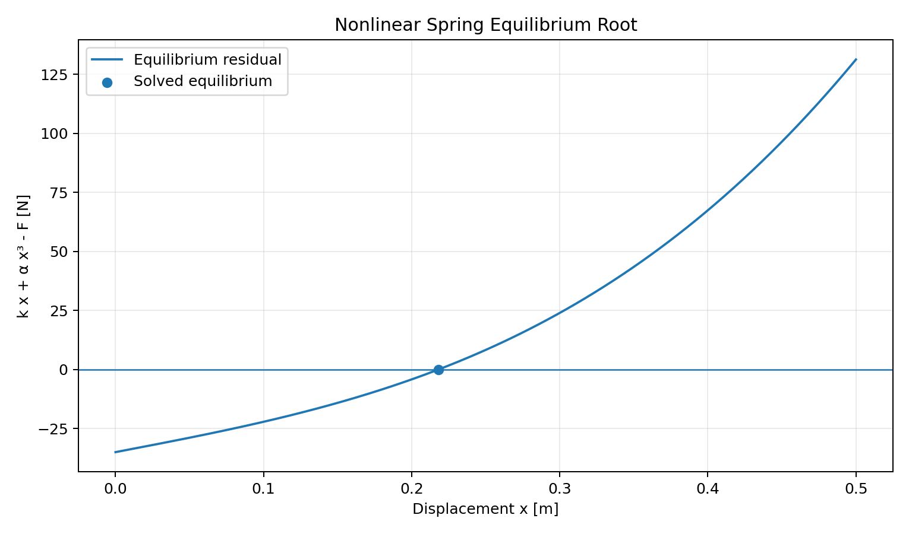
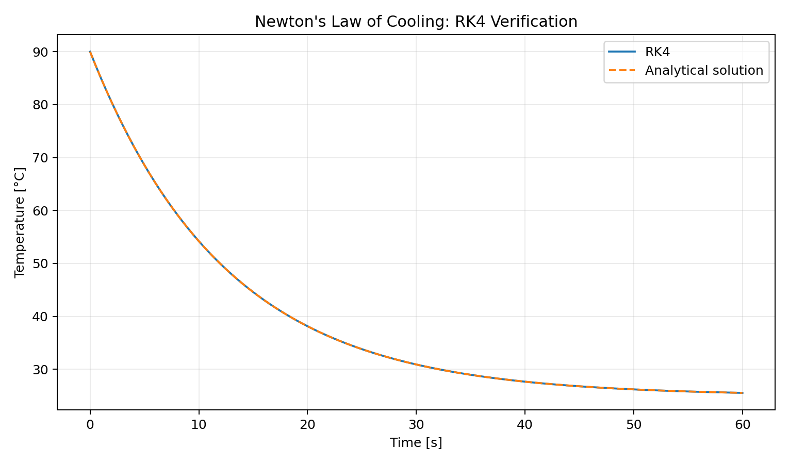

# Numerical Methods for Engineering in Python

A collection of **numerical methods implemented from first principles and applied to engineering problems**, with NumPy/SciPy/Matplotlib used for verification, data handling, and visualization.





## Why this project exists

The objective is to demonstrate numerical engineering reasoning rather than simply calling library functions. Core algorithms are implemented directly, then exercised on practical examples and checked against analytical or expected results.

## Implemented methods

### Nonlinear equations
- bisection
- Newton-Raphson
- secant method

### Numerical integration
- composite trapezoidal rule
- composite Simpson's rule

### Ordinary differential equations
- classical fourth-order Runge-Kutta (RK4)

### Data analysis
- linear least-squares fitting
- coefficient of determination (`R²`)

## Engineering examples

- nonlinear spring equilibrium solved with three root-finding methods
- Newton's law of cooling solved by RK4 and checked against the analytical solution
- load-cell style sensor calibration using linear least squares

## Run it

```bash
python -m venv .venv
# Windows: .venv\Scripts\activate
# Linux/macOS: source .venv/bin/activate
pip install -e . pytest
python examples/root_finding_comparison.py
python examples/cooling_ode.py
python examples/sensor_calibration.py
pytest -q
```

## Current release: v0.1

- root-finding algorithms with convergence information
- numerical integration
- RK4 ODE solver
- least-squares calibration
- three engineering examples
- automated tests and cross-platform CI

## Planned extensions

- interpolation and spline methods
- finite-difference differentiation
- optimization methods
- eigenvalue problems
- FFT and signal-processing examples
- uncertainty propagation and Monte Carlo analysis
